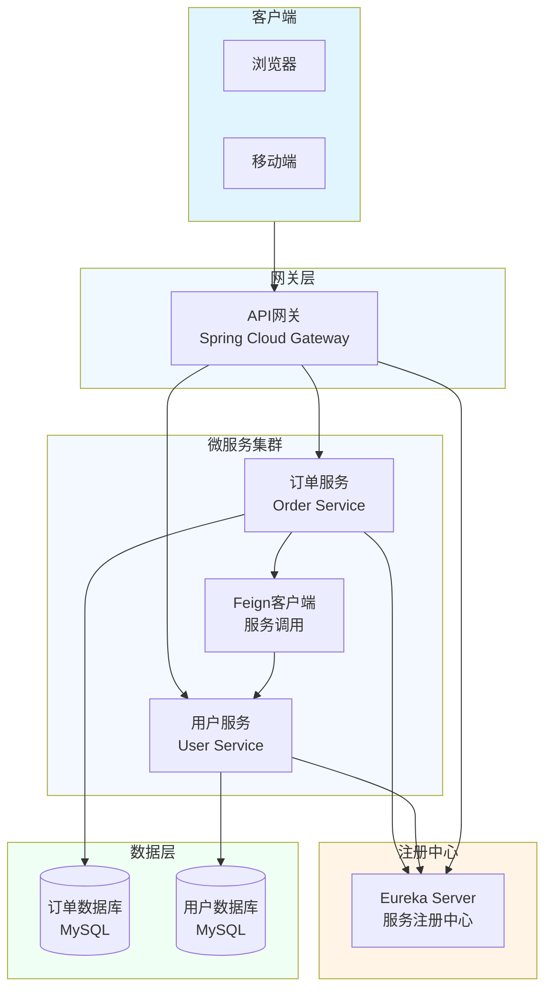

# st-springCloud0 - Spring Cloud 微服务学习项目


> Spring Cloud 微服务架构学习项目,包含服务注册、网关、负载均衡等核心组件

## 📖 项目简介

st-springCloud0 是一个 Spring Cloud 微服务架构学习项目,演示了微服务架构的核心组件和服务治理能力。项目包含了服务注册中心、网关服务、订单服务、用户服务、Feign客户端等模块,是学习 Spring Cloud 微服务架构的完整示例。

## 🏗️ 系统架构



## 🛠️ 技术栈

| 技术 | 版本 | 说明 |
|------|------|------|
| **Spring Boot** | 3.0.3 | 基础框架 |
| **Spring Cloud** | 2022.0.0 | 微服务框架 |
| **Spring Cloud Netflix Eureka** | - | 服务注册中心 |
| **Spring Cloud Gateway** | - | API网关 |
| **Spring Cloud OpenFeign** | - | 服务调用 |
| **Java** | 17 | 开发语言 |
| **MySQL** | 8.0 | 数据库 |
| **MyBatis-Plus** | 3.5.7 | ORM框架 |

## 📦 项目模块

### 1. eureka-server (服务注册中心)
- 端口: 10086
- 功能: 服务注册与发现
- 依赖: spring-cloud-starter-netflix-eureka-server

### 2. gateway-server (API网关)
- 端口: 10010
- 功能: 路由转发、负载均衡、统一入口
- 依赖: spring-cloud-starter-gateway

### 3. user-service (用户服务)
- 端口: 8081
- 功能: 用户管理、用户查询
- 数据库: user_db

### 4. order-service (订单服务)
- 端口: 8082
- 功能: 订单管理、订单查询
- 数据库: order_db
- 调用: 通过Feign调用用户服务

### 5. feign-api (Feign客户端)
- 功能: 定义服务间调用的接口
- 依赖: spring-cloud-starter-openfeign

## 🚀 快速开始

### 环境要求
- JDK 17+
- Maven 3.6+
- MySQL 8.0+

### 启动顺序

1. **启动Eureka注册中心**
```bash
cd eurekaServer
mvn spring-boot:run
```
访问: http://localhost:10086

2. **启动用户服务**
```bash
cd userService
mvn spring-boot:run
```

3. **启动订单服务**
```bash
cd orderService
mvn spring-boot:run
```

4. **启动网关服务**
```bash
cd gatewayServer
mvn spring-boot:run
```
访问: http://localhost:10010

### 验证服务

#### 检查服务注册
访问 Eureka 控制台: http://localhost:10086
可以看到已注册的服务列表

#### 测试服务调用
```bash
# 通过网关访问用户服务
curl http://localhost:10010/user/1

# 通过网关访问订单服务
curl http://localhost:10010/order/1
```

## 📁 项目结构

```
st-springCloud0/
├── eurekaServer/                # Eureka注册中心
│   ├── src/main/java/
│   │   └── EurekaApplication.java
│   └── src/main/resources/
│       └── application.yml
├── gatewayServer/               # API网关
│   ├── src/main/java/
│   │   └── GatewayApplication.java
│   └── src/main/resources/
│       └── application.yml
├── userService/                 # 用户服务
│   ├── src/main/java/
│   │   ├── controller/
│   │   ├── service/
│   │   ├── mapper/
│   │   └── entity/
│   └── src/main/resources/
│       └── application.yml
├── orderService/                # 订单服务
│   ├── src/main/java/
│   │   ├── controller/
│   │   ├── service/
│   │   ├── mapper/
│   │   └── entity/
│   └── src/main/resources/
│       └── application.yml
└── feignApi/                    # Feign客户端
    └── src/main/java/
        └── clients/
            └── UserClient.java
```

## 🔧 核心配置

### 1. Eureka Server配置
```yaml
server:
  port: 10086

spring:
  application:
    name: eureka-server

eureka:
  client:
    service-url:
      defaultZone: http://localhost:10086/eureka
    register-with-eureka: false  # 不注册自己
    fetch-registry: false        # 不拉取服务
```

### 2. Gateway配置
```yaml
server:
  port: 10010

spring:
  application:
    name: gateway-server
  cloud:
    gateway:
      routes:
        - id: user-service
          uri: lb://user-service
          predicates:
            - Path=/user/**
        - id: order-service
          uri: lb://order-service
          predicates:
            - Path=/order/**

eureka:
  client:
    service-url:
      defaultZone: http://localhost:10086/eureka
```

### 3. 服务提供者配置
```yaml
server:
  port: 8081

spring:
  application:
    name: user-service
  datasource:
    url: jdbc:mysql://localhost:3306/user_db
    username: root
    password: password

eureka:
  client:
    service-url:
      defaultZone: http://localhost:10086/eureka
```

### 4. Feign客户端配置
```java
@FeignClient("user-service")
public interface UserClient {
    @GetMapping("/user/{id}")
    User findById(@PathVariable Long id);
}
```

## 🎯 核心功能

### 1. 服务注册与发现
```java
@SpringBootApplication
@EnableEurekaServer
public class EurekaApplication {
    public static void main(String[] args) {
        SpringApplication.run(EurekaApplication.class, args);
    }
}
```

### 2. 服务间调用
```java
@RestController
@RequestMapping("/order")
public class OrderController {
    @Autowired
    private UserClient userClient;
    
    @GetMapping("/{id}")
    public Order getOrder(@PathVariable Long id) {
        Order order = orderService.getById(id);
        // 通过Feign调用用户服务
        User user = userClient.findById(order.getUserId());
        order.setUser(user);
        return order;
    }
}
```

### 3. 网关路由
```java
@SpringBootApplication
public class GatewayApplication {
    public static void main(String[] args) {
        SpringApplication.run(GatewayApplication.class, args);
    }
}
```

### 4. 负载均衡
```yaml
spring:
  cloud:
    loadbalancer:
      ribbon:
        enabled: false
```

## 📊 服务架构说明

### 服务注册流程
1. 服务启动时向Eureka注册自己的信息
2. Eureka维护服务注册表
3. 服务消费者从Eureka拉取服务列表
4. 通过负载均衡选择服务实例

### 服务调用流程
1. 客户端请求到达网关
2. 网关根据路由规则转发到对应服务
3. 服务通过Feign调用其他服务
4. Feign通过负载均衡选择服务实例

## 🔍 测试验证

### 1. 健康检查
```bash
# 检查Eureka状态
curl http://localhost:10086/actuator/health

# 检查网关状态
curl http://localhost:10010/actuator/health
```

### 2. 服务调用测试
```bash
# 直接调用用户服务
curl http://localhost:8081/user/1

# 通过网关调用用户服务
curl http://localhost:10010/user/1

# 调用订单服务(会调用用户服务)
curl http://localhost:10010/order/1
```

## 📈 扩展功能

### 1. 服务熔断
```xml
<dependency>
    <groupId>org.springframework.cloud</groupId>
    <artifactId>spring-cloud-starter-circuitbreaker-resilience4j</artifactId>
</dependency>
```

### 2. 配置中心
```xml
<dependency>
    <groupId>org.springframework.cloud</groupId>
    <artifactId>spring-cloud-config-server</artifactId>
</dependency>
```

### 3. 链路追踪
```xml
<dependency>
    <groupId>org.springframework.cloud</groupId>
    <artifactId>spring-cloud-starter-sleuth</artifactId>
</dependency>
```

## 📝 学习要点

### 微服务核心概念
- **服务注册与发现**: Eureka
- **负载均衡**: Ribbon / Spring Cloud LoadBalancer
- **服务调用**: Feign
- **网关路由**: Gateway
- **配置管理**: Config
- **服务熔断**: Circuit Breaker

### 最佳实践
- 服务拆分原则
- 数据库分离策略
- 服务间通信方式
- 容错与降级处理

## 📝 更新日志

### v1.0.0
- 初始化项目结构
- 集成Eureka注册中心
- 集成Gateway网关
- 实现服务间Feign调用
- 配置负载均衡

## 🤝 贡献指南

欢迎提交 Issue 和 Pull Request!

## 📄 许可证

本项目采用 AGPL-3.0 许可证 - 查看 [LICENSE](LICENSE) 文件了解详情

## 📮 联系方式

- 作者: junw
- Email: wo1261931780@gmail.com
- GitHub: [@wo1261931780](https://github.com/wo1261931780)

## 🙏 致谢

感谢 Spring Cloud 社区的支持!

---

**说明**: 本项目主要用于学习 Spring Cloud 微服务架构,包含微服务的核心组件和最佳实践。
